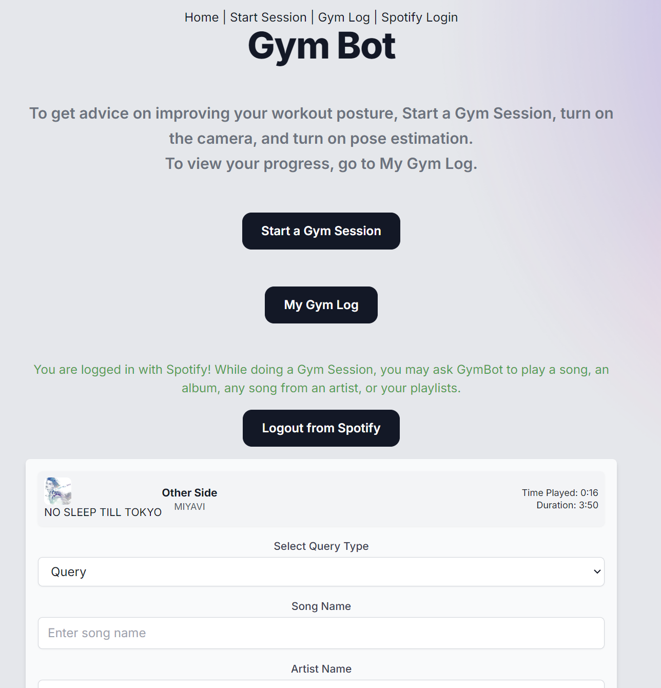
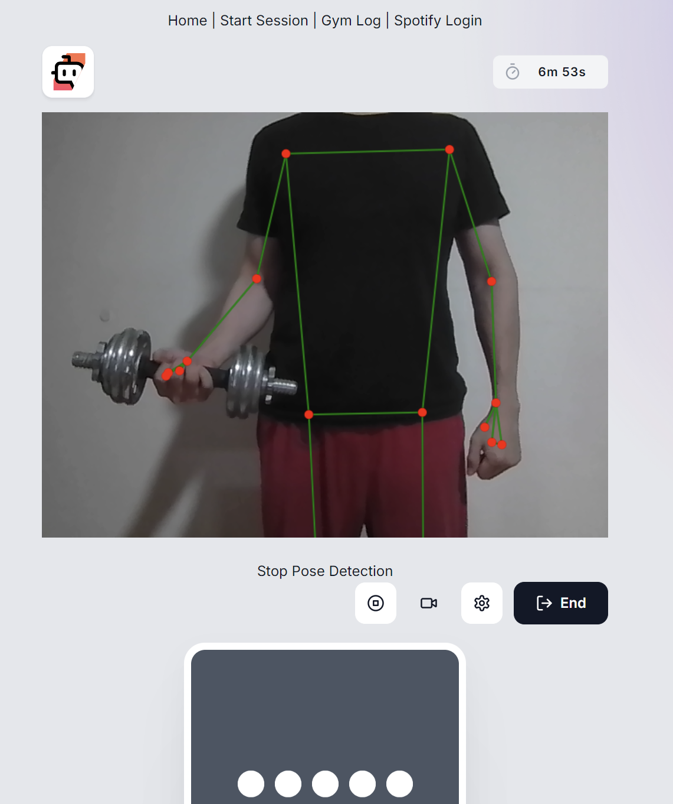

# Gym Bot

Your personal workout companion. Powered by https://www.daily.co/, built on https://www.pipecat.ai/. Pose detection by [MediaPipe](https://mediapipe-studio.webapps.google.com/studio/demo/pose_landmarker).





Comparing workout postures via point clouds might be more accurate rather than pixels in videos. The goal is to have an AI that can correct our movements as we are exercising.

### Configure your local environment

```shell
touch .env.local
```

Sample values:

```
NEXT_PUBLIC_BASE_URL=/api
DAILY_API_KEY=xxx
DAILY_BOTS_URL=https://api.daily.co/v1/bots/start
OPENAI_API_KEY=xxx
SPOTIFY_CLIENT_ID=xxx
SPOTIFY_CLIENT_SECRET=xxx
SPOTIFY_REDIRECT_URI=http://localhost:3000/api/spotify/callback
```

`NEXT_PUBLIC_BASE_URL` defaults to `/api`, which is configured as Next server-side route handler. You can pass through service API keys, override service and config options within this route.

`DAILY_BOTS_URL` URL of the Daily Bots `start` endpoint (https://api.daily.co/v1/bots/start)


`DAILY_API_KEY` your Daily API key obtained by registering at https://bots.daily.co.

`OPENAI_API_KEY` Optional: provide a OpenAI API key. Daily Bots does not provide an integrated OpenAI service, so to use it, you will need to provide your own key. You can read more about integrated and 'bring your own key' [here](https://docs.dailybots.ai/api-reference/client/supportedServices).

### Install dependencies

```shell
yarn 
```

### Run the project

```shell
yarn run dev
```